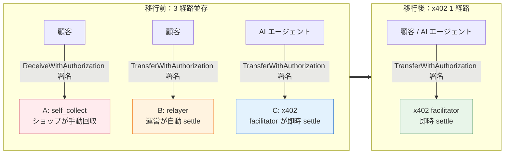
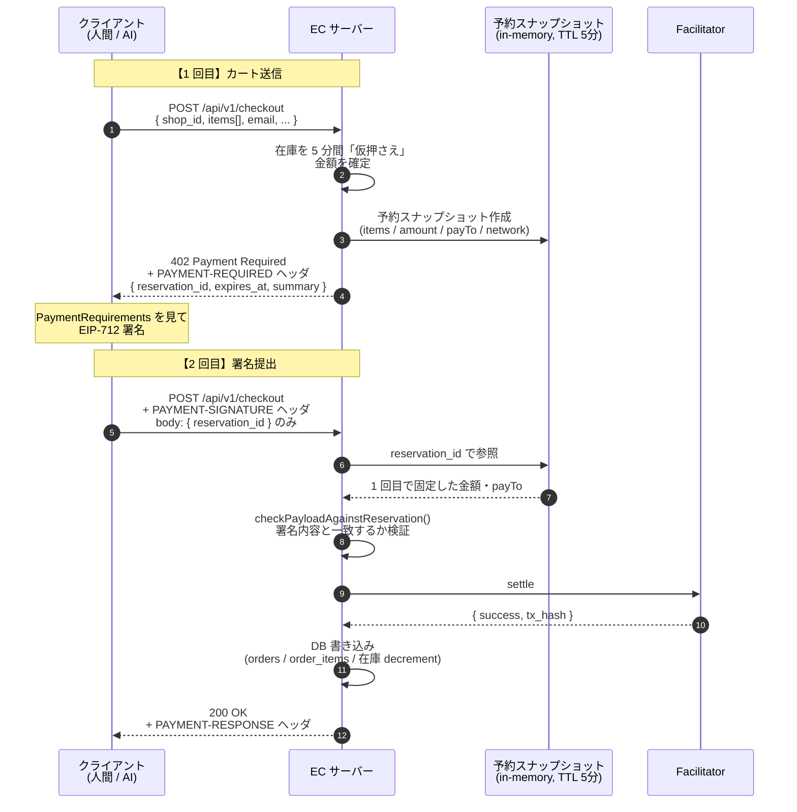
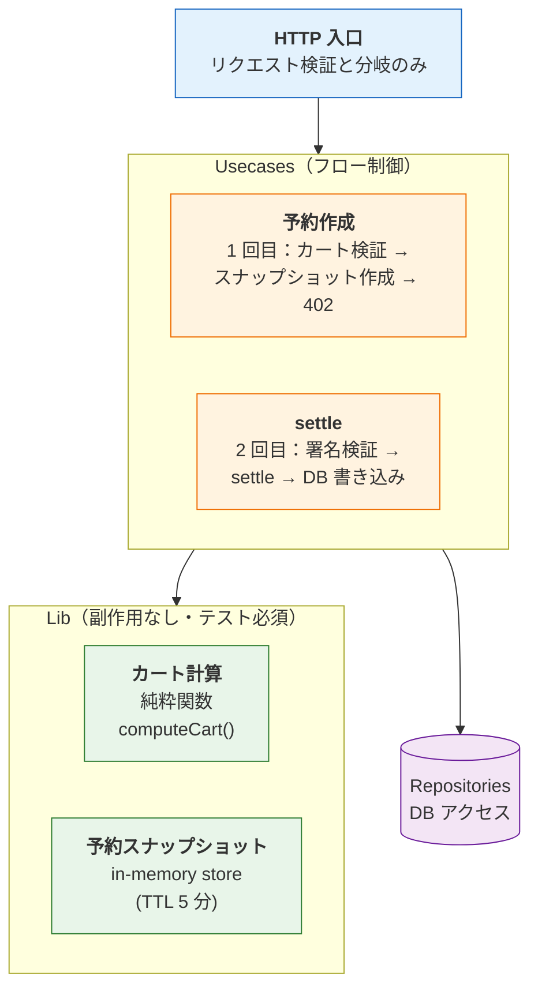
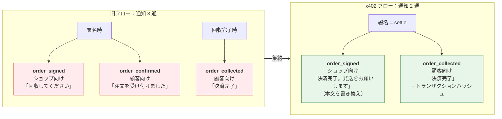

## はじめに

決済プロトコル **x402** は、coinbase が提唱する HTTP-native な決済の仕組みで、HTTP ステータスコード `402 Payment Required` をそのまま使って支払いをします。AI エージェントでは、 HTTP の形で決済できるので相性が良いのですが、人間の買い物にも通用するのではと思ったところが今回x402導入に至った背景です。

x402 の仕様や概要はこちらにまとまっています。

https://www.x402.org/

ところが、いざ既存の EC システムを x402 に移行しようとすると、「エンドポイントを差し替えるだけでしょ?」と思ってましたが、実際は決済経路が複数並存していたり、注文情報をどう運ぶかを EC 側で設計し直す必要があったり... 想像以上に大変でした。

この記事では、JPYC 建ての多店舗 EC プラットフォームを x402 に **完全移行した記録** を、コードレベルでお伝えします。3 つあった決済経路を 1 つに畳み、人間の買い物も AI エージェントの買い物も同じ HTTP エンドポイントに通すまでの設計判断・つまずき・最終的な実装を書いていきます。x402 への移行を検討しているエンジニアや、決済システムを運用している方、AIの決済導入を考えている経営者を想定しています。具体的な移行のイメージを掴んでいただければ幸いです!

なお、Facilitator 側(オンチェーン settle を担う Cloudflare Workers)の話は別リポの「Facilitator 編」に分けてあります。この記事は **EC プラットフォーム側** の視点に絞ってお伝えします。

:::message
ここで述べる設計判断は私個人の考えで、所属先の公式見解ではありません。
:::

---

## 0. 前提：何のシステムか

JPYC EC Platform は、ショップが **JPYC(日本円ステーブルコイン、1 JPYC = 1 円)**で決済を受けられるマルチテナント SaaS です。
https://ec.jpyc-service.com/
（ショップオーナーにかかる費用は毎月の売り上げ手数料1%のみ！）技術的な肝は **EIP-3009 のガスレス送金**で、買い手はガス代を払わずに「署名」だけして、プラットフォームがオンチェーンの送金を代行します。

この「ガスレス送金をどう成立させるか」の部分が、今回の移行で扱うところです。

---

## 1. なぜ移行したか ── 3 つの決済経路が並存していた

移行前は、決済経路が **3 つ**並存していました。まずはこの「並存状態」がどういうものだったかを見ていきます。



| 経路 | プラン | 仕組み | 買い手が署名する型 |
|---|---|---|---|
| A | `self_collect` | 顧客が署名 → **ショップが手動で回収**(ガス代はショップ負担) | `ReceiveWithAuthorization` |
| B | `relayer`(おまかせ) | 顧客が署名 → **運営の relayer が自動 settle** | `TransferWithAuthorization` |
| C | x402(AI エージェント用) | エージェントが署名 → **x402 facilitator が即時 settle** | `TransferWithAuthorization` |

初期実装は経路 A・B だけでした。`admin` 側にショップの手動回収用コード、`storefront` 側に注文作成のコードとチェックアウト画面があり、注文はEIP-712 署名 → ショップ回収、というモデルでした。

その後 AI エージェント向けに経路 C(x402)を追加し、3 経路並存に至りました。ちなみにこの時のAIエージェント決済はデジタル商品のみで、単品購入しかできませんでした。

### 並存が生んだ具体的な負債

- **テスト経路が 3 倍**。リグレッション検出コストがそのまま 3 倍になります。
- **公開 API が 2 系統**。外部に出すと認知負荷が高いです。
- **self_collect の「署名済み・未回収」注文が長期放置されるリスク**。買い手は
  署名したのに、ショップが回収するまで(最大 3 日)決済が完了しません。
- **経路 B と C のコードが重複**。どちらも relayer wallet で
  `transferWithAuthorization` を呼ぶだけなのに別実装になっていました。
- **公開 REST 経路に設計バグまがいの穴**。あるAPIでは在庫をロックしているのに、あるAPIでは在庫をロックしていないなど...。これは「並存」が隠していた事故源だったなと思います。

### x402 という選択

経路 C で使っていた **x402**(coinbase が提唱する HTTP-native な決済プロトコル、v2)を「正」としてこのシステムに取り入れることにしました。理由は単純で、x402 は

> **HTTP 402 Payment Required を実際に使い、ヘッダで支払い要求と署名を
> やり取りする**

という、AI エージェントだけでなく、人間にも同じ形で通用する決済の作法だと思ったからです。「人間用」と「AI 用」を分ける必要が、プロトコルのレベルで無くなります。

ちなみに少し補足すると、x402 は **Google が 2025 年 9 月に発表した AI エージェント決済プロトコル AP2（Agent Payments Protocol）の公式拡張**としても組み込まれていて、AP2 のステーブルコイン決済レーンを担う位置づけになっています（[AP2 ドキュメント](https://ap2-protocol.org)）。Coinbase・Mastercard・MetaMask・Ethereum Foundation など 60 以上の組織が AP2 に参画している中で、x402 が暗号資産決済の標準的な選択肢として選ばれた格好です。今回の移行は社内事情から始めたものでしたが、外の世界でもこの方向に揃いつつあるのだなと、少し背中を押された感じがありました。

ここで一つ、移行を通じて何度も効いてくる**概念の分離**を最初に書いておきます。

> **x402 は「決済プロトコル」しか規定しません。「注文情報を運ぶ HTTP
> インターフェース」は EC 側の仕様です。**

x402 が定めるのは「402 を返す」「`PAYMENT-REQUIRED` ヘッダに支払い要求をbase64url で載せる」「`PAYMENT-SIGNATURE` ヘッダで署名を受け取る」といった**決済の握手**だけです。一方「カートに何が入っているか」「送料はいくらか」「のしは付けるか」「贈り物の届け先は誰か」といった**注文の中身**は、x402 の管轄外で、完全に EC 側が決めます。

この分離を見落とすと「x402 に移行する = エンドポイントを差し替えるだけ」と誤解してしまいます。実際には、レガシー REST が持っていた注文情報の表現力を、x402 エンドポイントに**移植**する作業が本体でした(§3 で詳述します)。

---

## 2. 移行のゴール
EC運営側としてはシステム移行にあたって、ガス代は運営負担になるので、負荷は大きくなります。しかし、オーナーさんに今まで1%だった手数料を2%で！とは言いたくありませんでした。なので一律ガス代込み込みで1%に設定しています。

| 指標 | 移行前 | 移行後 |
|---|---|---|
| ショップが選ぶプラン | 2 種類(1% / 2%) | **1 種類(1%)** |
| 購入用の公開 API | 3 エンドポイント | **1(`POST /api/v1/checkout`)** |
| relayer 既存ショップの手数料 | 2% | **1%(値下げ)** |
| 在庫ロック期間(人間のカート) | 最大 7 日 | **5 分** |
| 注文が最終状態に達するまで | 数時間〜7 日 | **即時**(署名から 1 往復) |

「人間も AI も `POST /api/v1/checkout` 一本」「プランは 1 つ」「注文は署名した瞬間に確定」。これまでよりもオーナーさんにも運営側としてもシンプルにすることがゴールでした。

---

## 3. 4フェーズで段階的移行

移行というと、つい一気に切り替えたくなります。が、それは結構危険でした。

今までの注文(署名済み・未回収)を抱えたまま経路を一斉に切り替えると、「署名したのに決済が完了しない」顧客が出てしまいます。ロールバックも難しい。なので**4 フェーズ**に分けました。各フェーズは独立したコミットになっていて、それぞれ単独でデプロイ・検証できるようにしています。それでは、4 つのフェーズを順に見ていきましょう。

```
Phase A  x402 エンドポイントの機能拡張
Phase B  人間チェックアウトを x402 化
Phase C  プラン統合(1% 一律)
Phase D  旧コードの物理削除
```

### Phase A ── x402 エンドポイントに「カートの表現力」を移植する
移行前の x402 経路は **単品しか買えませんでした**。URL に商品 ID が埋まっているので、構造的にカートを表現できないのです。

- 多商品カート
- NFT 割引
- 注文オプション(のし・到着時間・メッセージカード)
- 贈答情報(贈り物フラグと届け先)
- 送料計算(送料無料閾値、および購入すると送料無料になる対象商品の判定)
- 顧客メールアドレスの必須化

#### 設計判断：単品エンドポイントを「新設しない」

x402 化にあたり「単品用 `/products/:id/checkout` と多商品用 `/checkout`を両方持つ」案もありましたが、シンプル イズ ベストということで、統一することにしました。`shop_id` を URL ではなくbody で受け、`items[]` でカートを表現します。

#### 2 段階フローと「予約スナップショット」

x402 のフローは HTTP 2 往復になります。EC 実装での具体は以下のとおりです:

```
1 回目: POST /api/v1/checkout  (PAYMENT-SIGNATURE ヘッダなし)
  body: { shop_id, items[], customer_email, shipping?, ... }
  ↓ サーバが在庫を 5 分間「仮押さえ」、金額を確定
  → 402 Payment Required
     headers: PAYMENT-REQUIRED (base64url の x402 PaymentRequired)
     body:    { reservation_id, expires_at_unix_ms, summary }

2 回目: POST /api/v1/checkout  (PAYMENT-SIGNATURE ヘッダあり)
  body: { reservation_id }            ← items 等は再送しない
  ↓ 署名検証 → facilitator が settle → DB 書き込み
  → 200 OK + PAYMENT-RESPONSE ヘッダ
```

ここで肝になるのが **「2 回目の body は `reservation_id` だけ」** という設計です。

1 回目で受け取った注文内容は `X402CheckoutReservationSnapshot` という**サーバ側のスナップショット**(in-memory、TTL 5 分)に固定されます。2 回目はこのスナップショットを参照して settle します。`items` も `discount`も `shipping` も再送させません。



なぜそうするのか。

> **署名時に買い手が承諾した金額と、DB に書かれる金額が、構造的に
> 一致することを保証するためです。**

もし 2 回目で `items` を再送させると、「1 回目で 5,000 円と言われて署名したのに、2 回目で 3,000 円分の `items` を送る」といった改竄の余地が生まれてしまいます。`reservation_id` だけにすれば、買い手が署名した対象はスナップショットそのものなので、すり替えようがありません。

実装上の安全弁が `checkPayloadAgainstReservation()` です。署名された PaymentPayload とスナップショットを突き合わせ、`amount` / `payTo` / `network` / `authorization.value` のいずれかが食い違えば `payload_mismatch` で拒否します。

```typescript
// 移行完了時点の実コード
export function checkPayloadAgainstReservation(
  payload: PaymentPayload,
  reservation: X402CheckoutReservationSnapshot,
): { ok: true } | { ok: false; reason: string } {
  if (payload.accepted.amount !== reservation.amounts.totalAtomic) {
    return { ok: false, reason: `amount mismatch: ...` }
  }
  if (payload.accepted.payTo.toLowerCase() !== reservation.payTo.toLowerCase()) {
    return { ok: false, reason: "payTo mismatch" }
  }
  if (payload.accepted.network !== `eip155:${reservation.chainId}`) {
    return { ok: false, reason: "network mismatch" }
  }
  if (payload.payload.authorization.value !== reservation.amounts.totalAtomic) {
    return { ok: false, reason: "authorization.value mismatch" }
  }
  return { ok: true }
}
```

#### レイヤー分離 ── カート計算は「純粋関数」に隔離

Phase A で新設したコンポーネント群:

| コンポーネント | 役割 |
|---|---|
| HTTP 入口 | リクエスト検証と分岐のみ |
| 予約作成 usecase | 1 回目:カート検証 → スナップショット作成 → 402 |
| settle usecase | 2 回目:署名検証 → settle → DB 書き込み |
| カート計算 lib | **カート計算の純粋関数**(在庫・variant・割引・オプション・送料) |
| 予約スナップショット lib | スナップショットの保持(in-memory store) |
| バリデーション | リクエスト body の Zod スキーマ |

このプロジェクトは「Loaders/Actions → Usecases → Lib → Repositories」という単方向のレイヤーアーキテクチャを敷いています。Lib は**副作用のない純粋関数で、テストを必須**としています。



カート計算、つまり「この商品構成・この配送先・この割引・このオプションだと、小計いくら・送料いくら・合計いくら」を計算する処理を `computeCart()` という純粋関数に隔離したのは、この方針に従ったからです。DB アクセスもネットワークも持たないので、入力と出力だけでテストできます。

失敗はすべて型付きエラーで表現します:

```typescript
export type CartComputationError =
  | { code: "product_missing"; productId: string }
  | { code: "insufficient_stock"; productId: string; ... }
  | { code: "variant_required"; productId: string; productName: string }
  | { code: "invalid_variant"; productId: string; productName: string }
  | { code: "no_shipping_rate" }
  | { code: "invalid_checkout_option"; field: string; message: string }
```

#### 旧エンドポイントは「Deprecation 付き proxy」として残す

`POST /api/v1/products/:id/checkout` は、外部の SKILL(後述します)が 0.1.0 で叩く前提でした。いきなり消すと後方互換を壊してしまいます。なので内部で `/api/v1/checkout` を呼ぶようにした上で、RFC 8594 の廃止予告ヘッダを全レスポンスに付けました:

```typescript
const DEPRECATION_HEADERS = {
  Deprecation: "true",
  Sunset: SUNSET_DATE,
  Link: '</api/v1/checkout>; rel="successor-version"',
}
```

「すぐ消す」ではなく「予告して、移行期間を置いて、消す」というやり方です。

### Phase B ── 人間のチェックアウトも x402 に通す

Phase A で AI エージェント向けのエンドポイントは整いました。Phase B では**人間のチェックアウト画面** を、同じ `POST /api/v1/checkout` に通します。

人間用のチェックアウト画面は既に wagmi での署名・MetaMask モバイル復帰(sessionStorage)・チェーン選択・残高チェック・NFT 割引チェックを実装済みでした。これらは温存し、**「署名後の通信先」だけを差し替える**方針です:

```
旧: createOrderAction → signTypedDataAsync → submitSignatureAction(orderId, signature, address)
新: POST /api/v1/checkout (1回目) → signTypedDataAsync → POST /api/v1/checkout (2回目)
```

新設した x402 チェックアウトクライアントが、人間 UI 側から x402 の2 段階フローを叩く役割を担います(`startX402Reservation()` / `settleX402Checkout()`)。EIP-712 の typed-data ビルダーも別途用意しました。

#### plan_type 分岐の消滅

移行前、チェックアウト画面には **plan_type による分岐が 8 箇所以上**ありました。最も本質的なのが署名する型の切り替えです:

```typescript
// 移行前
planType === "self_collect"  → ReceiveWithAuthorization を署名
planType === "relayer"        → TransferWithAuthorization を署名
```

x402 では facilitator(の relayer wallet)が `msg.sender` になって`transferWithAuthorization` を呼びます。よって買い手が署名するのは常に`TransferWithAuthorization` です。**`ReceiveWithAuthorization` 経路は消えます**。

移行完了時点の typed-data ビルダーを確認すると、`TransferWithAuthorization`のフィールド定義しか持っていません:

```typescript
const FIELDS = [
  { name: "from", type: "address" },
  { name: "to", type: "address" },
  { name: "value", type: "uint256" },
  { name: "validAfter", type: "uint256" },
  { name: "validBefore", type: "uint256" },
  { name: "nonce", type: "bytes32" },
] as const
// primaryType: "TransferWithAuthorization" 固定
```

`ReceiveWithAuthorization` は実コードからは消えました。

#### 「署名有効期限」が意味を失う

旧フローではショップ設定の署名有効期間(デフォルト 3 日)が重要でした。署名から回収まで猶予が要るからです。x402 では署名した瞬間にsettle されるので、この値は**ユーザー体験上の意味を失います**。代わりにx402 の `maxTimeoutSeconds`(デフォルト 90 秒)を使います。

### Phase C ── プランを 1 つに畳む

settle が運営代行の 1 経路になった以上、「ショップが自分で回収するself_collect プラン」は存在意義がありません。プランを `relayer` 1 種・手数料 1% 一律に統合しました。

設計上、`plan_type` enum と `fee_rate` カラム自体は**残しました**。過去の注文・過去の手数料計算履歴がこれらを参照しているからで、削除すると履歴が壊れてしまいます。やったのは「新規入力経路を全部 `relayer` / `0.01` に固定する」ことです。

### Phase D ── 旧コードを物理削除する

ペンディングの注文が消化されたのを待って、旧コードを物理削除しました。差分が `−923` 行で、移行の「畳んだ」感が一番出る数字です。

削除したもの:
- 旧注文作成 usecase
- `createOrderAction` / `submitSignatureAction` の Server Action
- `POST /api/v1/orders` の実装(GET = 注文履歴は残す)
- `POST /api/v1/orders/:id/signature` のルート(まるごと)
- relayer をトリガーするヘルパー
- 内部用の relayer 実行エンドポイント

**残したもの**もあります。サブスク・プラットフォーム支援の3 つの relayer キューは、x402 facilitator を経由せず EC 内部の admin がrelayer wallet で `transferWithAuthorization` を直接実行する設計のままです。これらは「今回の移行対象外」と明示的に決め、relayer 実行のコードを残しました。

---

## 4. 移行後のアーキテクチャ ── @shared/x402 という自前ツールキット

x402 は比較的新しいプロトコルで、JPYC(EIP-3009 トークン)に合うライブラリが手元にありませんでした。なので結局、`shared` パッケージの中に**自前の x402 v2 ツールキット**を実装しました。

| コンポーネント | 役割 |
|---|---|
| 型定義 (schemas) | x402 v2 の型(`PaymentRequirements` / `PaymentPayload` / `SettlementResponse` 等)を Zod で定義 |
| ビルダー | EC の概念(chainId・payTo・JPYC atomic 金額)から `PaymentRequired` を組む |
| EIP-712 ドメイン | JPYC の EIP-712 ドメイン(`name: "JPY Coin"`, `version: "1"`) |
| CAIP-2 ユーティリティ | CAIP-2(`eip155:137` 等)の相互変換 |
| base64url ユーティリティ | ヘッダ用の base64url。**ブラウザ / Node 両対応**(後述のつまずき) |
| facilitator クライアント | facilitator の `/verify` `/settle` を叩く HTTP クライアント |
| ヘッダ・バージョン定数 | ヘッダ名と `X402_VERSION = 2` の定数 |

### facilitator は「差し替え可能」にした

`FacilitatorClient` は、`baseUrl` をコンストラクタで受け取ります。facilitator のホストはコードに埋め込みません:

facilitator URL は `facilitatorUrlFromEnv()` が環境変数 `FACILITATOR_URL`から一度だけ読みます。この「差し替え可能」設計が後で効いてきました。デモショップ機能(§7)や、facilitator 障害時の切り分けで、facilitator を一点に固定していないことが助けになりました。

### facilitator 障害は「502」にマッピングする
facilitator は別リポ・別インフラ(Cloudflare Workers)で動く外部依存です。ネットワーク断・タイムアウト・5xx・非 JSON レスポンスといったケースが起きたとき、EC が素朴に書くと「facilitator のレスポンスを Zod パースしようとして例外 → 500」になってしまいます。

`FacilitatorClient` は失敗を `FacilitatorError` という型付き例外に畳みます。呼び出し側はこれを捕まえて **502(upstream failure)** にマップします。500(EC 自身のバグ)とは区別するわけです。

```typescript
// facilitator クライアント(実物)
// Non-2xx: the facilitator itself errored (worker exception, 5xx, 4xx).
// Surface it as a typed error so callers can map it to a 502 instead of
// crashing on a schema-parse failure.
if (!res.ok) {
  throw new FacilitatorError(
    `facilitator ${path} returned HTTP ${res.status}: ...`,
    { path, status: res.status, body: text.slice(0, 200) },
  )
}
```

「外部依存の失敗」と「自分のバグ」を HTTP ステータスで切り分けられるようにしておく。これは後日、実際の facilitator 障害(§5)で切り分けの決め手になりました。

---

## 5. つまずいた話 ── `unexpected_settle_error` の切り分け

移行後、staging で x402 checkout が `500` を返す事象が起きました。エラーコードは `unexpected_settle_error`。EC・facilitator・SKILL の 3 者(それぞれ別リポ)で切り分けることになりました。

最初、facilitator 側からは「EC checkout の 500 は EC 側の問題」と言われました。ですが §4 の「facilitator 障害は 502」の設計のおかげで、EC が返していたのは構造化された 502 で、EC のコードは正しく動いていました。facilitator側がこの時問題だとわかったので、問題の切り分けができて調査がしやすかったです。

結局原因は、**facilitator の relayer ウォレットのガス枯渇**でした。0 円であってもオンチェーンの `transferWithAuthorization` トランザクションは走ります。そのガスを払う relayer ウォレットの残高が、1 トランザクション分にも満たなかったのです。ノードが「funds for gas」で送信を拒否し、facilitator がそれを `unexpected_settle_error` という汎用エラーに畳んでいたため、切り分けが遠回りになってしまいました。

## 6. つまずいた話・その2 ── 移行が「通知メール」を落としていた
今まで通知メールは下記の通り行なっていました。
- ショップ向け通知(署名時)= 「回収してください」
- 顧客向け注文受付通知(署名時)= 「注文を受け付けました」
- 顧客向け決済完了通知(回収完了時)= 「決済完了」

しかし、テスト中メールが届かないことがおきました。原因は「旧コードの除去」として一括でやったとき、その旧コードに**新フローへ移すべき部分が混じっていた**ことを見落としました...。

### 直し方 ── x402 のフロー特性に合わせて移植する

通知ブロックをそのまま新 usecase にコピーするのではなく、x402 のフロー特性に合わせ直しました。旧フローは「署名(`status=2`(署名済み))」と「回収(`status=3`(決済完了))」が別ステップで、上記のように通知メールは 3 つに分かれていました。ですが x402 では署名と settle が一体で、注文は即`status=3` です。「回収」というステップ自体が存在しません。そのまま移植するとショップに「回収してください」という、x402 では意味をなさないメールが飛んでしまいます。



なので、次のように対応しました:

- **ショップ向け**: ショップ向け通知のイベント自体は再利用しますが、メール本文の
  「管理画面から署名を回収してください」を「決済が完了しました。回収など
  の操作は不要です。商品の発送をお願いします」に**書き換えました**。
- **顧客向け**: 旧フローの「注文受付」+「決済完了」の 2 通を、x402 では
  決済完了通知(トランザクションハッシュ入り)**1 通**に
  集約しました。署名と決済が同時な以上、「受け付けました、後で決済します」という
  中間状態のメールは嘘になってしまうからです。

移植先は settle usecase の **DB トランザクションがコミットされた後**です。通知は `try/catch` で個別に包み、**fire-and-forget**(失敗しても注文確定は取り消さない)にしました。

## 9. 移行後の最終形

移行完了時点のコードは以下のとおりです:

**注文・決済の経路**
- 購入は `POST /api/v1/checkout` ただ 1 つです。人間 UI も
  AI エージェントも、専用クライアント経由 / 直接 HTTP の
  違いはあれど、同じエンドポイント・同じ 2 段階フローを通ります。
- 単品 `POST /api/v1/products/:id/checkout` は Deprecation / Sunset / Link
  ヘッダ付きの proxy として残存しています(後方互換期間)→現在削除済み
- `POST /api/v1/orders` は **削除済み**(GET = 注文履歴のみ残存)。
  `POST /orders/:id/signature` も**削除済み**です。

**署名**
- 買い手が署名するのは常に `TransferWithAuthorization` です。
  `ReceiveWithAuthorization` は実コードから消滅しています(コメントの説明文のみ残ります)。
- nonce は 32 byte ランダム、`validBefore` は x402 の `maxTimeoutSeconds`
  (デフォルト 90 秒)ベースです。

**注文ステータス**
- `1` 未署名(旧フローの名残、新フローでは作られない)
- `3` 決済完了(x402 settle 完了。新フローの注文は最初からここ)
- `9` 期限切れ

**プラン**
- 全 active ショップが `relayer` プラン・手数料 1% です。`plan_type` /
  `fee_rate` カラムは過去履歴参照のため残しています。

**書き込みの atomicity**
- settle 成功時、`orders` + `order_items` + 在庫 decrement +
  x402 決済の監査行を **単一 DB トランザクション**で書きます。

**facilitator との関係**
- EC は facilitator の `/verify` `/settle` を `FacilitatorClient` 経由で
  呼ぶだけです。facilitator URL は環境変数で差し替え可能です。
- facilitator の失敗は `FacilitatorError` → HTTP 502 にマップします。

---

## 10. まとめ ── この移行から残したい知見

今回は、3 つの決済経路が並存していた EC プラットフォームを、x402 という 1 つのプロトコルに完全移行するまでを書いていきました。
個人的に工夫したポイントとしては、「決済プロトコル」と「注文情報の HTTP インターフェース」を分けて考えたところです。 x402 が規定するのは前者、後者(カート・送料・オプション・贈答)は EC 仕様です。移行の本体は、レガシー REST が持っていた後者の表現力を x402 エンドポイントに移植する作業でした。

これまで EC は「人間が画面でポチる」前提で作られてきましたが、x402 のように HTTP そのものに決済が乗ると、人間も AI エージェントも区別なく同じ入口を通れるようになります。買い物という行為が、人とソフトウェアの境界を越えて当たり前にやり取りされる。そんな世の中がすぐそこまで来ていると信じています。今回の移行も、その未来にワクワクしながら進めました。

---

:::message
**JPYC を使った開発のご相談について**

JPYC（日本円ステーブルコイン）を使った開発の受託・技術相談を「MAMETA」として承っています。決済の導入、スマートコントラクト開発、AI エージェント × ステーブルコインの PoC など、「自社サービスに JPYC を組み込みたい」「まずプロトタイプを作ってみたい」といったご相談があれば、お気軽にどうぞ。

https://dev.jpyc-service.com/
:::
