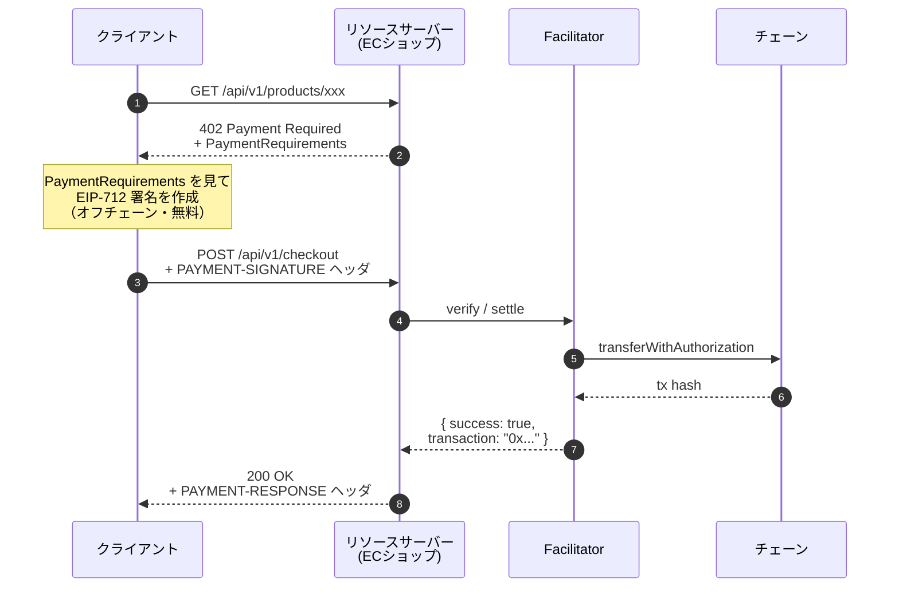

## はじめに

JPYC建てのECプラットフォーム（[jpyc-ec-platform](https://github.com/Mameta29/jpyc-ec-platform)）の決済を、x402プロトコルへ完全移行しました。
https://ec.jpyc-service.com/
この記事はそのうち **Facilitator** 、つまり「署名されたトランザクションを実際にオンチェーンへ流すリレイヤー」をゼロから設計・実装・本番運用するまでを詳細にまとめたものです。

ECショップ本体（カート、注文確定、在庫管理）の話は「EC編」で書くことにして、ここでは徹底してFacilitator側に絞っていきます。プロトコルの仕組み、なぜその設計にしたか、コードレベルで何をしたか、どこで詰まったか、インフラ選定の理由など、できるだけ具体的にお伝えできたらと思います。

この記事は「x402という単語は聞いたことがあるが、Facilitatorが内部で何をしているのかは知らない」というエンジニアや、「自社に組み込むにはどうしたら良いのか知りたい」というEC運営をされている経営者の方などを想定しています。読み終えたとき、自前でx402 Facilitatorを設計するときに「何をやって、何をやらないか」の判断軸を持ち帰っていただけたら嬉しいです！

:::message
ここで述べる内容は私個人の考えで、所属先の公式見解ではありません。
:::

## 1. そもそもx402とFacilitatorとは何か

x402は「HTTPの上で支払いを完結させる」プロトコルです。名前はHTTPステータスコード `402 Payment Required` から来ています。長らく予約語のまま誰も使ってこなかった402に、ようやく中身が入った形になりました。

典型的なフローは次のようになります。



ここで重要なのは **役割分担** だと思います。


- **クライアント（買い手）**: 署名するだけです。ガスも払いません。ウォレットにJPYCがあれば大丈夫です。
- **リソースサーバー（ECショップ）**: 「いくら欲しいか」を提示し、決済の成否を受け取ります。**チェーンには一切触れません。**
- **Facilitator**: 署名を検証し、ガスを払い、トランザクションをブロードキャストし、結果を返します。**唯一のオンチェーン**とやり取りするレイヤーです。

つまりFacilitatorは「リソースサーバーがブロックチェーンを一切知らなくて済むようにするための、署名→オンチェーン決済の変換装置」です。ECショップ側のエンジニアは `viem` も `ethers` も知らなくて大丈夫です。HTTPで `/verify` と `/settle` を叩くだけになります。

移行しようと思った理由も、ここに繋がっています。元々のECプラットフォームには複数の決済経路が並存していて、決済の窓口がバラバラでした。x402のように「HTTPの上で決済が完結する」プロトコルに揃えれば、**決済の入口を1つに統一できて設計が綺麗になる**と考えました（経路を統合していく具体的な話はEC編に譲ります）。

補足として、x402 は **Google が 2025 年 9 月に発表した AI エージェント決済プロトコル AP2（Agent Payments Protocol）の公式拡張**としても組み込まれました。AP2 はカード・銀行振込・暗号資産・ステーブルコインなど決済手段を問わない汎用プロトコルなのですが、そのステーブルコイン決済レーンとして選ばれたのが x402 です（[AP2 ドキュメント](https://ap2-protocol.org)）。Coinbase・Mastercard・MetaMask・Ethereum Foundation など 60 以上の組織が AP2 に参画していて、その中で x402 が暗号資産決済の標準的な選択肢に位置づけられた形です。

そしてもともと x402 は「AI エージェント向け」として作られたわけではなく、HTTP の `402 Payment Required` を素直に使う設計です。つまり**人間のブラウザからの fetch にも、AI エージェントの fetch にも、まったく同じ形で通用する**。だからこそ「人間用と AI 用の決済を分けない」というモデルが自然に成立しますし、AP2 のような AI エージェント向け文脈でも、特別な改造なしに採用できたのだと思います。

そしてこの記事の主役は、この変換装置を **JPYC専用に、自前で** 作った話です。

なぜ自前なのか。x402には公式のリファレンスFacilitator（[x402-foundation/x402](https://github.com/x402-foundation/x402)、旧 coinbase/x402）があります。ですが公式実装は「あらゆるscheme・あらゆるチェーンファミリーに対応する汎用品」を目指しています。私が欲しかったのは「JPYCの、EIP-3009での決済だけを、確実に・狭い攻撃面で・低コストに捌く」専用品でした。この方針判断はこの記事の随所に効いてくるので、まず頭に置いておいていただければと思います。

---

## 2. なぜJPYCならFacilitatorが綺麗に書けるのか ── EIP-3009

ここからは、なぜJPYCを選ぶとFacilitatorが「狭く・確実」に書けるのか、その鍵になる **EIP-3009** という規格を見ていきます。これは設計のあちこちに効いてくる話なので、少し丁寧に追っていきます。

https://eips.ethereum.org/EIPS/eip-3009

x402の `exact` scheme（「ぴったりこの金額を払う」scheme）でEVMトークンを動かす方法はいくつかありますが、代表的なのが次の2つです。

- **EIP-2612 `permit`**: `approve` を署名で代替します。ですが「approveしてからtransferFrom」の2ステップが必要です。
- **EIP-3009 `transferWithAuthorization`**: 署名そのものが「送金の許可」になります。**ワンショットで送金が完結します。**

JPYCはEIP-3009をネイティブ実装しています。USDCと同じEIP-3009規格に対応していて、`transferWithAuthorization(from, to, value, validAfter, validBefore, nonce, v, r, s)` を呼ぶと、署名さえ正しければ `from` から `to` へ `value` だけ即座に送金されます。中間approveも要りません。

これがFacilitator設計に決定的に効いてきます。**攻撃面が狭い**のです。

- 中間approveがない → 「approveの残量を悪用される」経路が存在しない
- リプレイ防止がトークンコントラクトに内蔵されている → `_authorizationStates[authorizer][nonce]` というmappingで、一度使われたnonceは二度と使えない

だからFacilitatorは `assetTransferMethod === "eip3009"` というリテラル制約を **わざと厳格に** 課しています。JPYC専用Facilitatorとしては、寛容であることはメリットではなく攻撃面の拡大でしかないと考えています。

EIP-712の型定義は次のようになります（`packages/shared/src/domain.ts`）。

```typescript
export const TRANSFER_WITH_AUTHORIZATION_TYPES = {
  TransferWithAuthorization: [
    { name: "from",        type: "address" },
    { name: "to",          type: "address" },
    { name: "value",       type: "uint256" },
    { name: "validAfter",  type: "uint256" },
    { name: "validBefore", type: "uint256" },
    { name: "nonce",       type: "bytes32" },
  ],
} as const
```

ひとつ補足です。EIP-3009には `transferWithAuthorization` のほかに `receiveWithAuthorization` もあります。後者は `to == msg.sender` を強制します。x402の `exact` schemeで `transferWithAuthorization` を選ぶのは、**オンチェーンの `msg.sender` がFacilitatorのリレーヤーウォレットであってECショップではないから**です。

（ちなみにx402以降前は、ショップオーナー自身で顧客から預かった署名を実行するアーキテクチャをとっていたので、`receiveWithAuthorization`を採用していました。）

---

## 3. 全体アーキテクチャと「やらないこと」の決定

設計で一番時間をかけたのは、機能を足すことではなく **「やらないことを決めること」** でした。

**やること（スコープ）:**
- JPYC × EIP-3009 専用のFacilitator
- `exact` scheme のみ
- x402 protocol v2 のみ（v1互換は捨てる）

**やらないこと（明示的に却下）:**
- 公式のような汎用 multi-scheme / multi-chain-family Facilitator
- EIP-3009 以外の送金方式への対応
- lifecycle hooks（onBefore/After/Failure）
- Postgres による audit テーブル
- Redis による分散ロック

最近AIさんにめちゃくちゃ言われる「YAGNI（You Aren't Gonna Need It）」を、なんとなくの感覚ではなく **明文化されたルール** として運用しました。「いつか必要になるかも」で抽象化レイヤを足すのは、watchすべきコードの面積を増やすだけで、JPYC専用品としては純粋な負債になるんですよね。

結果として、モノレポは次のようになりました（pnpm + turbo）。

| パッケージ | 役割 |
| --- | --- |
| `@jpyc-x402/shared` | 型、CAIP-2ヘルパー、JPYCチェーンレジストリ、EIP-712ドメイン、zodスキーマ |
| `@jpyc-x402/evm` | EIP-3009 の verify / settle ロジック、マルチRPCフォールバック |
| `@jpyc-x402/facilitator` | Honoルーター（`/verify`, `/settle`, `/supported`）、DB-free |
| `@jpyc-x402/client` | ペイロード署名、Facilitator呼び出しのHTTPラッパー |
| `@jpyc-x402/mcp` | LLMエージェントから叩くためのMCPサーバー |

そして「デプロイ可能なアプリ」は `apps/worker`（Cloudflare Workers + Durable Object）です。`@jpyc-x402/facilitator` コアを `import` するだけの薄い殻になっています。

層の依存関係はきれいに一方向です。`shared` ← `evm` ← `facilitator` ← `apps/worker` という形で、`shared` は何にも依存せず、`apps/worker` は誰からも依存されません。コアから Workers 固有の処理（Durable Object など）を分離してあるので、コアコードは Workers のことを知らずに済んでいます。

---

## 4. verify ── 7つの検証チェック

Facilitatorの `/verify` は「この署名済みペイロードは、ブロードキャストしたら成功するか？」を **ガスを1円も払わずに** 判定します。x402の `exact` EVM scheme仕様（`scheme_exact_evm.md`）が定める6つのチェックに、私が1つ足して、計7つを実行します。


### チェック0：requirements の整合性

クライアントが署名対象とした `accepted` ブロックと、サーバーが要求した `paymentRequirements` が一致するかを見ます。scheme・network・amount・asset・payTo・EIP-712ドメイン名/バージョン、これらが食い違っていれば、署名は「別の何か」に対するものになります。

```typescript
export function checkRequirementsMatch(
  payload: PaymentPayload,
  required: PaymentRequirements,
): { ok: true } | { ok: false; reason: string } {
  if (payload.accepted.scheme  !== required.scheme)  return { ok: false, reason: "scheme mismatch" }
  if (payload.accepted.network !== required.network) return { ok: false, reason: "network mismatch" }
  if (payload.accepted.amount  !== required.amount)  return { ok: false, reason: "amount mismatch" }
  // asset / payTo は小文字化して比較（チェックサムアドレスの大小で誤判定しない）
  if (payload.accepted.asset.toLowerCase() !== required.asset.toLowerCase())
    return { ok: false, reason: "asset mismatch" }
  // ...
  return { ok: true }
}
```

ここでひとつ判断があります。`extra.decimals` と `extra.symbol` は **検証しません**。これらは表示用のadvisoryな情報で、署名の安全性には関係しないからです。検証する項目（scheme/network/amount/asset/payTo/domain）と、しない項目（decimals/symbol）を意識的に分けています。「全フィールド一致を確認しておけば安心」ではなく、「何が安全性に効くか」で線を引いています。

### チェック1：署名リカバリ（と high-s 拒否）

EIP-712ダイジェストを再計算し、署名から復元したアドレスが `authorization.from` と一致するかを見ます。

ここで **公式仕様にはない独自対策** を1つ入れています。リカバリの前に **high-s署名を拒否** します。

```typescript
// secp256k1 の群位数 n の半分。EIP-2 / SEC1 §4.1.4。
const SECP256K1_N_HALF =
  0x7fffffffffffffffffffffffffffffff5d576e7357a4501ddfe92f46681b20a0n

export function rejectHighS(sig: Hex): void {
  const { s } = splitSignatureComponents(sig)
  if (BigInt(s) > SECP256K1_N_HALF) {
    throw new Error("non-canonical signature (high-s)")
  }
}
```

なぜか。ECDSA署名には **マレアビリティ（延性）** があります。`(r, s, v)` が有効な署名なら、`(r, n-s, v^1)` も**同じメッセージに対する有効な署名**になります。つまり「見た目の違う署名blob」を1つの署名から作れてしまうのです。

viemの `recoverAddress` は両方を有効として受理します。JPYCコントラクトは high-s を拒否するので、最終的にはオンチェーンで弾かれます。ですが私は **verifyの段階でも弾きます**。

これは攻撃される前提が今あるわけではないが、オンチェーン側の拒否条件と verify 側の許容条件を一致させておきたいタイプのものでした。

### チェック2：残高チェック

`balanceOf(from)` を読み、`value` 以上あるかを見ます。なければ `insufficient_funds` です。

### チェック3：金額と受取人の一致

`authorization.value` が `requirements.amount` と一致するか。`authorization.to` が `requirements.payTo` と一致するか。チェック0と重複するように見えますが、ここは「署名された生の数値」を見ています。チェック0は文字列比較、ここは意味的な一致確認です。

### チェック4：時間ウィンドウ

`now ∈ [validAfter, validBefore)` かを見ます。これは後述の「詰まった話①」の主役なので、ここでは「verifyとsettleが**同じ純関数 `checkTimeWindow` を共有する**」とだけ言っておきます。

### チェック5：シミュレーション

`simulateContract` で `transferWithAuthorization` を実際に実行してみます（チェーンの状態は変えない `eth_call`）。これが通れば、ブロードキャストもほぼ確実に通ります。

### チェック6：リプレイ（nonce消費済みチェック）

トークンコントラクトの `authorizationState(from, nonce)` を読みます。`true` なら、そのnonceは既に使われている＝リプレイです。

EIP-3009がオンチェーンでリプレイを防いでいるので、これは厳密には不要です。二度目のブロードキャストは勝手にrevertするからです。ですが**revertにもガスがかかります**。

ただし、このRPC読み取りが失敗したときに **verify全体を落とさないようにしています**。

「読めなかったから即エラー」ではなく「下流のsimulateが本当の問題を捕まえるので素通りさせる、ただしログは残す」という方針です。**ハードフェイルとソフトフェイルの線引き**を、各チェックごとに意識的に決めています。


## 5. settle ── ブロードキャストと nonce 直列化

`/settle` は verify を通したうえで、実際にトランザクションをブロードキャストします。一見「verifyしてwriteContractするだけ」に見えますが、ここに**並行処理の罠**があります。

### nonce 競合という問題

EVMのトランザクションには **アカウントnonce**（EIP-3009の認可nonceとは別物）があります。リレーヤーウォレットが送るトランザクションは `0, 1, 2, ...` と連番でなければチェーンに受理されません。

ここでサーバーレス環境特有の問題が出てきます。Cloudflare Workersは、1つのWorkerが**多数のisolateで並列に**リクエストを捌きます。同じチェーンへのsettleリクエストが2件同時に来ると、両方が「pending nonceは N だ」と読み、両方が nonce N でトランザクションを作り、**2件目がrevertしてしまいます**。

これを防ぐには「(チェーン, リレーヤーウォレット) ごとに、ブロードキャストを直列化する単一のポイント」が要ります。


### なぜ broadcast だけをロックするのか

直列化の素朴な実装は「settle全体をロックする」ですが、それはやってはいけません。

`transferWithAuthorization` の`receipt`確定は、Polygonで2〜3秒、Ethereumメインネットだと混雑時に30秒を軽く超えます。settle全体をロックすると、その間ほかのsettleが**全部待たされます**。スループットが死んでしまいます。

さらにCloudflare Durable Objectの `blockConcurrencyWhile`（後述）には **30秒のハードタイムアウト** があります。超えるとDOがリセットされます。`receipt`待ちをロック内でやると、Ethereumメインネットで普通にこの制限に当たってしまいます。

だから直列化区間を **nonce取得 + ブロードキャストだけ**（サブ秒で終わる）に絞り、`receipt`待ちはロックの外で並列に走らせています。

これが安全なのは、viemの `writeContract` が内部で `getTransactionCount({ blockTag: "pending" })` を呼ぶからです。これは「ブロードキャスト済みだがまだマイニングされていない」トランザクションも数えます。つまり**tx N をブロードキャストした瞬間に、tx N+1 は安全にブロードキャストできる**わけです。tx N がマイニングされるのを待つ必要はありません。

```
  1. broadcast()      — (chainId, signer) ごとに直列化必須（nonce安全性）
  2. waitForReceipt() — 完全に並行可
```

### settle の処理フロー

実際のsettleは次のように進みます。

1. **時間ウィンドウの再チェック**（verifyで一度見ましたが、ロック待ちの間に `validBefore` を跨ぐかもしれません。→ §8）
2. `writeContract` で `transferWithAuthorization` をブロードキャスト
3. `waitForTransactionReceipt` で`receipt`を待つ
4. `receipt`の `status === "success"` を確認
5. **`receipt`内のTransferイベントが、期待した `(from, to, value)` と一致するか再検証**

```typescript
const matched = receipt.logs.some((log) => {
  if (log.address.toLowerCase() !== chain.jpycAddress.toLowerCase()) return false
  if (log.topics[0] !== TRANSFER_EVENT_SIGNATURE) return false
  const from = `0x${log.topics[1]?.slice(-40)}`
  const to   = `0x${log.topics[2]?.slice(-40)}`
  if (from.toLowerCase() !== expected.payer.toLowerCase()) return false
  if (to.toLowerCase()   !== expected.payTo.toLowerCase()) return false
  return BigInt(log.data) === expected.valueAtomic
})
```

「ブロードキャストして成功ステータスが返ってきた」では足りません。**自分が意図したものが実際に動いたか**まで確認して、初めて `success: true` を返しています。

---

## 6. DB-freeへの移行 ── Postgresを捨てた判断

このプロジェクトでは、初めは Postgres を使っていました。途中でそれを **完全に削除** しました。これは本プロジェクトで最も大きなアーキテクチャ判断だったので、詳しく書いていきます。

### Postgresで何をしていたか

旧バージョンのPostgresには3つのテーブルがありました。

1. `settlements`（決済の監査ログ + リプレイ防止のためのUNIQUE制約）
2. `relayer_wallet_health`（リレーヤーウォレットの残高ヘルス）
3. レート制限テーブル

### 3つのテーブルをどこへ移したか

Postgresで持っていたのは大きく分けて3つでした。**`settlements`**（決済記録）、**`relayer_wallet_health`**（リレーヤー残高の最新値）、**レート制限テーブル**。それぞれをどう畳んだかを順に見ていきます。

#### `settlements` テーブル ── 2つの役割をそれぞれ別の場所へ

このテーブルは実は **2つの役割を兼任** していました。「リプレイ防止」と「監査ログ」です。それぞれを別の場所に任せました。

- **リプレイ防止の役割は丸ごと不要になりました。** EIP-3009のコントラクトが `_authorizationStates[authorizer][nonce]` というmappingでオンチェーンで持っているからです。同じ署名で2回ブロードキャストしても、2回目はコントラクトがrevertさせます。つまり、署名のユニーク性を保証するのに **DBのUNIQUE制約は要らなかった** わけです。
- **監査ログの役割は、stdoutへの構造化JSONログに移しました。** Workers Logs / Logpush / Axiom などのログアグリゲータがそれを受けます。「永続化されたDBにinsertしておく」のと「ログアグリゲータに送る」のは、監査用途では実質同じです（むしろ後者の方が検索性が高いことも多い）。

#### `relayer_wallet_health` ── インメモリの `BalanceCache` に置き換え

リレーヤーウォレットの残高の最新値を持っていたテーブルです。これは **`BalanceCache` というインメモリのキャッシュ** に置き換えました。タイマー（または cron）で定期的にチェーンから残高を取得して更新します。

DBに置く必要があったのは「ヘルスチェックで毎回チェーンを叩きたくない」からでしたが、それならプロセスメモリで十分です。失っても次のチェックタイミングで取り直せばいいだけです。

#### レート制限テーブル ── インメモリの `RateLimiter` に置き換え

「同じpayerからのリクエストを一定数まで」という制限です。`RateLimiter` というインメモリのデータ構造に置き換えました。

仕組みは **ローリングウィンドウのトークンバケット** です。payer ごとに「直近 N 秒のリクエスト数」と「直近 N 秒の JPYC 合計額」を持ち、上限に達したら拒否します。古いエントリは新しいリクエストが来たついでに掃除する（**遅延GC**）ので、別建てのタイマーは要りません。

```typescript
// Lazy GC: mapに触るたびに古いウィンドウのエントリを掃除する。
if (this.buckets.size > 1000) {
  for (const [k, b] of this.buckets) {
    if (b.windowStartMs < windowStartMs) this.buckets.delete(k)
  }
}
```


### DB-freeのトレードオフ

正直に書くと、DB-free にはトレードオフがあります。最大のものは **「シングルレプリカでしか正しく動かないコンポーネントが含まれる」** という点です。

具体的には、上で説明したインメモリの `RateLimiter` と `BalanceCache` がそれです。複数のレプリカ（インスタンス）で同じFacilitatorを動かすと、それぞれのプロセスが**別々のメモリを持つ**ので、payerごとのレート制限カウントがレプリカ間で共有されません。レプリカAでカウントが上限に達しても、レプリカBはそれを知らないので素通ししてしまいます。

これを「制約」ではなく「設計の前提」として受け入れることにしました。

というのも、JPYCのECプラットフォーム1つを捌くのに、複数レプリカは要らないからです。Cloudflare Workers では、Durable Object を 1 インスタンス（チェーンごとに 1 つ）で動かせば、世界中からのリクエストはそこに集約されます。レート制限のカウントも残高キャッシュも、その単一インスタンスのメモリにあるので一貫性が保たれます。

「将来分散したくなったら」のためにいま Redis を入れるのは、§3 で却下した「YAGNI 抽象化」そのものになります。**必要になった時点で入れればいい**、というのが今回の判断です。

**運用面の負荷もごっそり減りました。** Postgres を運用するときに付き合っていた「接続プールの調整」「スロークエリの監視」「マイグレーションの段取り」、これらの心配対象がまるごと消えたのは、想像以上に楽です。

## 7. インフラ：Cloudflare Workers + Durable Object

本番のWorkerデプロイを詳しく見ていきます。

### Durable Object が「単一直列化ポイント」を与える

§5で「(チェーン, リレーヤーウォレット) ごとの単一直列化ポイントが要る」と書きました。Cloudflare Durable Object（DO）はまさにこれを提供してくれます。

DOは「グローバルに一意なインスタンス」です。`idFromName("chain-80002")` で名前から決定的にIDを引くと、世界中のどのWorkerリクエストも**同じDOインスタンス**にルーティングされます。そしてDOの `blockConcurrencyWhile` は「このDOインスタンス内で、非同期コールバックを一度に1つしか走らせない」ことをCloudflareが保証してくれます。

```typescript
// 親 Worker: チェーンごとのDOにルーティング
const id = this.env.RELAYER.idFromName(`chain-${chainId}`)
const stub = this.env.RELAYER.get(id)
const broadcast = await stub.broadcast({ chainId, payer, payTo, ... })
```

`RelayerSignerDO` 側は次のようになります。

```typescript
async broadcast(input: DoBroadcastInput): Promise<DoBroadcastResult> {
  return await this.ctx.blockConcurrencyWhile(async () => {
    // ── ここはチェーンごとに直列。一度に1つだけ走る ──
    // 1. 時間ウィンドウ再チェック
    // 2. writeContract でブロードキャスト
    // （`receipt`待ちはここではやらない ── 親Workerが並列にやる）
  })
}
```

`blockConcurrencyWhile` の中身を「nonce取得 + ブロードキャスト」だけに絞り、30秒タイムアウトを確実に避けています。`receipt`待ちは DO の外、つまり親 Worker 側で `waitAndVerifyTransfer` が並列にやります。§5で説明した設計が、そのままコードの構造になっています。

### isolate ごとのステートという考え方

Workerのエントリポイント（`apps/worker/src/index.ts`）には、もう1つ面白い設計があります。Workerのfetchハンドラは**リクエストをまたいでステートレス**で、isolateごとに自分の facilitator / runner / cache インスタンスを持ちます。

これで問題ないのは次の理由からです。

- **レート制限**: isolateごとなので保守的（つまり実際の上限はグローバルRPC上限で頭打ち）
- **NonceCache**: ベストエフォートなので、isolate間で共有されなくても「重複ブロードキャスト＝revert1回分のガス」で済む
- **BalanceCache**: cronのscheduledハンドラがどのisolateでも更新する。エントリが無ければ「critical でない」にフォールバックするので、古いデータだけでsettleを拒否することはない

`BalanceCache` だけは、isolateの寿命をまたいで持たせたいです（残高は変動が遅いので）。だからモジュールスコープのクロージャで1つだけ持っています。

```typescript
const isolateState = (() => {
  let cache: { balance: BalanceCache } | null = null
  return {
    getOrInit(): { balance: BalanceCache } {
      if (cache) return cache
      cache = { balance: new BalanceCache({ lowNative: 0.05, criticalNative: 0.005 }) }
      return cache
    },
  }
})()
```

### cron で残高を監視する

`wrangler.jsonc` の `triggers.crons: ["*/1 * * * *"]` で、毎分 `scheduled` ハンドラが走ります。各チェーンのリレーヤー残高をRPCで読んで `BalanceCache` を更新します。残高が閾値を割れば `console.warn` でログに出ます。この監視ログが、後述の「詰まった話②」で原因特定の決め手になりました。

### staging と production の分離

`wrangler.jsonc` で2つのenvを定義しました。設計上の安全策をひとつ仕込んであります。デフォルトのWorker名を **staging** にしました。

```jsonc
{
  // bare な `wrangler deploy` はstagingを叩く（事故防止）。
  // productionは明示しないと叩けない。
  "name": "jpyc-x402-facilitator-staging",
  ...
  "env": {
    "staging":    { "routes": ["facilitator-staging.jpyc-service.com/*"], ... },
    "production": { "routes": ["facilitator.jpyc-service.com/*"], ... }
  }
}
```

`wrangler deploy` をうっかり引数なしで叩いても、本番には飛びません。`--env production` を明示して初めて本番に行きます。さらにGitHub Actionsのproductionデプロイには「`confirm` 入力に文字列 `deploy` を打たないと弾かれる」二重ガードと、Cloudflare environmentの承認ゲートを付けました。本番デプロイは「うっかり」では絶対に起きない構造にしています。

env差分も明確です。

- **staging**: `ENABLED_NETWORKS = eip155:80002,11155111,43113,1001`（テストネット4種）
- **production**: `ENABLED_NETWORKS = eip155:1,137,43114,8217`（メインネット4種）

両方とも placement hint は `aws:ap-northeast-1`（東京）です。JPYCユーザーが日本拠点に偏ることを考慮しました（→ §10）。

---

## 8. 詰まった話①：validBefore 期限切れ revert

ここから「詰まった話」を2つ書きます。どちらも本番運用の中で実際に踏んだバグで、原因究明のプロセスごとお伝えします。

### 症状

`/verify` は `200 isValid:true` を返します。なのに `/settle` が失敗します。レスポンスは `transferWithAuthorization reverted`、`transaction: ""`。手元で `eth_call` を叩くと普通に通ります。

「verifyが通ったのにsettleがrevertする。手元のsimulateは通る」。まじで悩みました。

### 原因

時間でした。

EIP-3009の認可には `validBefore` があります。「この時刻を過ぎたら無効」というものです。verifyの時点では `now < validBefore` で有効です。ですが、verifyからsettleの実ブロードキャストまでには時間が経ちます。

- HTTPの402ラウンドトリップ
- クライアントのEIP-712署名
- そして特に **Durable Objectの `blockConcurrencyWhile` のロック待ち**

同じチェーンへのsettleが混んでいると、自分のbroadcastコールバックは他のsettleの後ろにキューイングされます。キューを抜けて実際に走るころには `validBefore` を過ぎています。期限切れのEIP-3009認可を `writeContract` の内部simulateが実行し、「authorization is expired」でrevertさせていました。

手元の `eth_call` が通ったのは、単に**手元で叩いた時刻がまだウィンドウ内だった**からです。タイミング依存のバグでした。


### 公式はどうしているか

x402公式リファレンスFacilitatorでは、3段構えになっていました。

1. settle冒頭でverifyを**再実行**する
2. verifyの時刻チェックに **+6秒のグレース** を持たせる（"6 second buffer for block time"）
3. ブロードキャスト後のrevertは `parseEip3009TransferError` でエラーコードに正規化する

### 入れた修正

公式と「結果」は揃え、「手段」は私のアーキテクチャに合わせました。

**(a) 時間チェックを純関数に切り出しました**。

```typescript
export const BLOCK_TIME_GRACE_SECONDS = 6n  // 公式と同値

export function checkTimeWindow(
  validAfter: bigint,
  validBefore: bigint,
  now: bigint,
): string | null {
  if (now < validAfter) {
    return X402_ERROR_CODES.invalid_exact_evm_payload_authorization_valid_after
  }
  if (now + BLOCK_TIME_GRACE_SECONDS >= validBefore) {
    return X402_ERROR_CODES.invalid_exact_evm_payload_authorization_valid_before
  }
  return null
}
```

純関数にしたのは、**verify（読み取り、早期）とsettleパス（ブロードキャスト直前、ロック待ちの後）が、まったく同じチェックを実行する**ためです。ウィンドウはこの2つの間で閉じうるからです。同じ関数を共有していれば、判定がズレません。

**(b) DOロック取得後・ブロードキャスト直前で時間を再チェックします**（`relayer-signer-do.ts`）。

```typescript
async broadcast(input: DoBroadcastInput): Promise<DoBroadcastResult> {
  return await this.ctx.blockConcurrencyWhile(async () => {
    // 認可の時間ウィンドウを「ロックの中で」再チェックする。
    // 親Workerは既にverify済みだが、blockConcurrencyWhileは
    // このコールバックを他のsettleの後ろにキューイングしうる。
    // 自分が走るころには validBefore を過ぎているかもしれない。
    const now = BigInt(Math.floor(Date.now() / 1000))
    const timeError = checkTimeWindow(
      BigInt(input.validAfter), BigInt(input.validBefore), now,
    )
    if (timeError) {
      return { ok: false, reason: timeError }   // ガスを払わずに弾く
    }
    // ... ブロードキャスト
  })
}
```

**(c)** 設計判断として、DO内では **full re-verify ではなく時間チェックだけ** にしました。公式は「settle冒頭でverify全体を再実行」していますが、親 Worker 側で既に full verify を済ませています。さらに `blockConcurrencyWhile` の30秒制限があるので、ロック内で重いRPCを伴うfull verifyはやりたくありません。**ロック内で変わりうるのは時刻だけ**なので、時刻だけ再チェックすれば十分だと考えました。

**(d)** 関連して、認可の有効期間のデフォルト（`DEFAULT_MAX_TIMEOUT_SECONDS`）を 90秒 → 300秒 に伸ばし、`NonceCache` のTTLを 300秒 → 600秒 にしました。90秒だと、402ラウンドトリップ + 署名 + settle直列化の合計が、混雑時にウィンドウを食い尽くしてしまいます。

### 検証

stagingで、期限切れのペイロードを `/settle` に投げ、`errorReason = invalid_exact_evm_payload_authorization_valid_before`・`transaction: ""`（**ブロードキャストせずに**弾いた）を確認しました。ガスを1円も払わずに、明確なエラーコードで返せるようになりました。

## 9. 詰まった話②：unexpected_settle_error の正体

2つ目はもっと厄介でした。

### 症状

EC経由のsettleが `unexpected_settle_error` を返します。`transaction: ""` です。

`unexpected_settle_error` はx402のエラーコードの中でも最も曖昧な「その他いろいろ」バケットです。これだけ見ても何もわかりません。最初の仮説は「Amoy（Polygon testnet）の `RPC_URLS_80002` シークレットに設定したRPCが `eth_sendRawTransaction` で失敗しているのでは」というものでした。PolygonのRPCよく安定しないことが多いので。笑

### 原因究明

`wrangler tail` でstaging Workerのログで下記の表示です。

```
[balance] low chain=80002 address=0x8e82...4f8c balance=0.017391943670424525
```

リレーヤーウォレットのAmoy残高が **0.017 POL** でした。

念の為、オンチェーンでも確認。

```bash
# eth_getBalance
→ 0.01739 POL

# eth_gasPrice（Amoy testnet）
→ 約 500 gwei  ← testnetなのに異常に高い
```

計算してみます。`transferWithAuthorization` のガスは約100,000 gasです。Amoyの現行ガス価格が約500 gweiなら、1トランザクションのガス代は次のようになります。

```
100,000 gas × 500 gwei = 0.05 POL
```

単純にガス代不足ってことでした。

### なんで、詰まったか

ガス枯渇が原因だと特定したあと、もっと重要な問題に気づきました。**なぜ `unexpected_settle_error` という曖昧なエラーで返ってきたのか**、という点です。

リレーヤーウォレット自身のガス不足は、EIP-3009の**コントラクトrevertではありません**。`transferWithAuthorization` は実行すらされません。RPCノードが「送信者が `gasLimit × maxFeePerGas` を払えない」と、トランザクションを**送信時点で受理拒否**します。

ところがFacilitatorのbroadcast catchは、エラーをまず `parseEip3009RevertReason()` に通していました。これはEIP-3009の**コントラクトrevert文字列**（"authorization is expired" など）専用のパーサーです。ガス不足の文言（"insufficient funds for gas"）はここに含まれません。だからパーサーは `null` を返し、コードは `unexpected_settle_error` のフォールバックに落ちていました。

**ガス枯渇が、本物のコントラクトrevertと区別できないバケットに埋もれていたのです。** 


### 入れた修正

ガス枯渇を、コントラクトrevertとは**責務を分けて**分類するようにしました。

```typescript
/**
 * 「リレーヤーウォレットがガス切れ」を検出する。
 *
 * これはコントラクトrevertではない ── transferWithAuthorizationは
 * 実行すらされない。RPCノードが、リレーヤー（オンチェーンtxのfrom、
 * つまりFacilitator自身のウォレット）が gasLimit*maxFeePerGas を
 * 払えないため、生txを送信時点で拒否する。文言はノード実装で揺れる
 * ので、部分文字列セットで吸収する。
 */
const GAS_EXHAUSTION_FRAGMENTS: ReadonlyArray<string> = [
  "insufficient funds for gas",
  "insufficient funds for gas * price + value",
  "insufficient funds for transfer",
  "exceeds the balance of the account",
  "insufficient balance for transaction",
]

export function isRelayerGasExhaustionError(error: unknown): boolean {
  const haystack = extractErrorText(error).toLowerCase()
  if (!haystack) return false
  return GAS_EXHAUSTION_FRAGMENTS.some((needle) => haystack.includes(needle))
}
```

そして DO のブロードキャスト経路の catch で、**revert判定の前に**ガス枯渇を判定するようにしました。

```typescript
} catch (e) {
  // リレーヤーウォレット自身のガス切れはコントラクトrevertではない ──
  // まずこれを分類して、不透明な unexpected_settle_error バケットに
  // 絶対に埋もれさせない。
  if (isRelayerGasExhaustionError(e)) {
    return {
      ok: false,
      reason: FACILITATOR_INTERNAL_ERROR_CODES.facilitator_insufficient_native_balance,
    }
  }
  // EIP-3009 のコントラクトrevert文字列を既知のエラーコードに正規化
  const code = parseEip3009RevertReason(e)
  if (code) return { ok: false, reason: code }
  // それ以外 → unexpected_settle_error
  ...
}
```

ユニットテストも足しました。重要なのは **「ガス枯渇 ⇄ コントラクトrevert」の相互非誤判定** を検証することです。

```typescript
it("ガス枯渇エラーをコントラクトrevertと誤分類しない", () => {
  // 3チームを存在しないRPCバグ追いに走らせたリグレッション
  expect(parseEip3009RevertReason("insufficient funds for gas * price + value")).toBeNull()
})

it("EIP-3009コントラクトrevertでガス枯渇判定が誤発火しない", () => {
  expect(isRelayerGasExhaustionError("authorization is expired")).toBe(false)
  // ERC-20のトークン残高不足は「買い手の問題」── insufficient_funds に分類されるべきで、
  // 「リレーヤーのガス不足」とは別物
  expect(isRelayerGasExhaustionError("transfer amount exceeds balance")).toBe(false)
})
```

## 10. インフラ選定の理由

ここまでで触れた選定を、理由ごとに整理します。

### Cloudflare Workers を本番に選んだ理由

| 観点 | 判断 |
| --- | --- |
| **コスト** | Workers Paid が月$5。staging は Free でいける。Postgres を捨てた（§6）ので DB のホスティング費がゼロ。 |
| **レイテンシ** | placement hint `aws:ap-northeast-1`（東京）で、東京から 5〜30ms。 |
| **nonce直列化** | Durable Object の `blockConcurrencyWhile` が、追加インフラなしで「グローバルに一意な直列化ポイント」を提供する（§7）。Redis も分散ロックも要らない。 |
| **スケール** | 〜50 req/s の混合トラフィックで、CPUは1リクエストあたりsub-15ms。Workers Paid の月間30M CPU-msは約200万settle/月をカバーする。 |

唯一のロックインは「DOクラスのファイル1つ」です。これは許容範囲と判断しました。

### 東京リージョンに置いた理由

JPYC ECの想定ユーザーは日本です。FacilitatorはECショップとチェーンの間に挟まる同期的なホップです。ここのレイテンシは決済UXに直に効いてきます。

## 12. まとめ

ECショップをx402へ完全移行した、そのFacilitator側の記録でした。完全移行して気づきましたが、z402はAIだけでなく、人間UIとしても優れているという面です。

この移行のあとEC側のコードでは `viem` を一行も書いていません。HTTPで `/verify` と `/settle` を叩くだけです。チェーンの複雑さは、すべてこのFacilitatorの内側に閉じ込めました。それがx402移行で達成できたことです。

自前でFacilitatorをゼロからつくるのは、JPYC専用品でも結構骨が折れましたが、`402 Payment Required` という長年空き家だったステータスコードに、自分の手で中身を入れていく作業は、純粋に楽しかったです！ x402に興味を持たれた方は、ぜひ公式リポジトリ（[x402-foundation/x402](https://github.com/x402-foundation/x402)）も覗いて、小さな `/verify` から触ってみられることをお勧めします。

ちなみに今回の記事で書いた **ガス枯渇エラーの専用コード化**（§10）と **settle 後の Transfer event 再検証**（公式の `exact/eip3009` settle にも欲しい防御）は、公式リファレンスFacilitatorにも還元したくて PR を出してます。[#2384](https://github.com/x402-foundation/x402/pull/2384)（ガス枯渇エラーの分類、TS/Go/Python 3 SDK 横断）と [#2385](https://github.com/x402-foundation/x402/pull/2385)（Transfer event 再検証）です。マージされるかはこれからですが、JPYC専用に作った中で「これは汎用的に役立つはず」と思った部分は、こうやって本家に戻していきたいですね。

HTTPを叩くのと同じ感覚でお金が動く。ECサイトの決済も、いずれエンジニアが「チェーンを意識せずに組み込める当たり前のもの」になっていくと思います。

:::message
**JPYC を使った開発のご相談について**

JPYC（日本円ステーブルコイン）を使った開発の受託・技術相談を「MAMETA」として承っています。決済の導入、スマートコントラクト開発、AI エージェント × ステーブルコインの PoC など、「自社サービスに JPYC を組み込みたい」「まずプロトタイプを作ってみたい」といったご相談があれば、お気軽にどうぞ。

https://dev.jpyc-service.com/
:::
