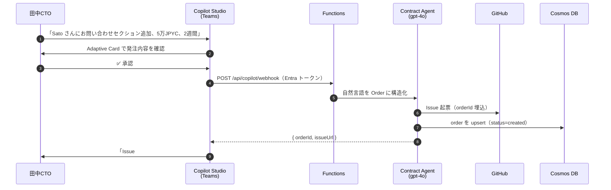
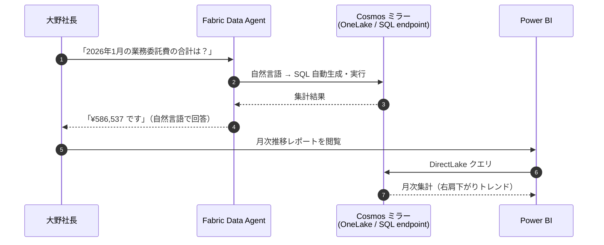

## はじめに

「副業3,000万人時代」と言われます。AI の普及で個人の生産性のばらつきが一気に広がり、これからの労働の単位は **「何時間働いたか」より「どのタスクを完了させたか」** に寄っていくはずだと、個人的には思っています。中小企業からすると、その流れで業務委託先が増えるほど、月末の経理がどんどん重くなっていきます。請求書を1件ずつ手入力して、銀行サイトで振込フォームを埋めて、海外のフリーランサーには着金まで3〜5日待ってもらって、振込手数料は1件あたり数千円。これ、毎月やるのは地味にしんどいです。

この記事では、その月末経理を **AI エージェントと JPYC（円建てステーブルコイン）でまるごと消す** システム「**Agentic Gig-Flow**」を作った話を書いていきます。発注から検収、報酬の支払い、仕訳・源泉徴収の記帳までを、複数の AI エージェントが自律的に回します。一番の山場は、**GitHub で PR をマージした約3秒後に、海外にいるフリーランサーへ円建ての報酬が着金する**ところです。

Agentic AI を業務に組み込みたいと考えているエンジニアや、中小企業で経理・バックオフィスの負荷に困っている方にぜひ読んでもらいたいです！Microsoft の Copilot Studio / Azure Functions / Foundry（Azure OpenAI）/ Fabric / Entra ID をどう組み合わせて「業務改革」まで持っていったか、具体的な実装イメージを掴んでいただければ幸いです。

「技術的な話はいらない！まず動くところが見たい！」という方は、下のデモ動画と [9. 業務改革インパクトの試算](#9.-業務改革インパクトの試算) に飛んでください。

:::message
本記事は Microsoft Agent Hackathon powered by Tokyo Electron Device への個人参加作品として開発したものです。ここで述べる内容は私個人の考えで、特定の所属先の公式見解ではありません。
:::

#### デモ動画

@[youtube](6Uy_3ml6bxQ)

#### 上記デモの...
- Issue
https://github.com/Mameta29/gigflow-demo-workspace/issues/23

- PR
https://github.com/Mameta29/gigflow-demo-workspace/pull/24

- オンチェーントランザクション
https://amoy.polygonscan.com/tx/0x5906c3fe023c786266700e872140c5e73084ed61dde0dad2f1542c23475521f5

#### GitHub

- プロジェクトリポ
https://github.com/Mameta29/agentic-gig-flow

- デモ用のワーカー側リポジトリ
https://github.com/Mameta29/gigflow-demo-workspace


-----

## 2. なぜ作ったか

副業・業務委託で働く人は、日本だけで3,000万人規模と言われています。発注側の中小企業からすると、これは「取引先が一気に増える」ということでもあります。そして取引先が増えるほど効いてくるのが、**月末のバックオフィス業務**です。

具体的に、従業員10名ほどの架空の IT コンサル会社があったとして、そこのCTO 田中さんの「月末の1日」はこんな感じになるのではないでしょうか。

- 業務委託先から届いた請求書 PDF を、経理ソフトに1件ずつ手入力する
- 銀行のサイトを開いて、振込フォームに口座番号と金額を打ち込む
- 業務委託の支払いは多くの会社で **月末締め・翌月末払い**。月初に仕上げてくれた仕事でも、入金は最大2ヶ月近く先になる
- 海外在住のフリーランサーへの送金は、その振込日からさらに着金まで3〜5日かかる。手数料も1件あたり数千円
- フリーランサーからは「振込まだですか？」と催促が来る
- 月末締めで、経営者から「今月の外注費いくらだった？」と聞かれて集計する

これ、一つひとつは大した作業ではないんですが、**取引先の数だけ掛け算で増えていく**のがつらいです。フリーランサー側も、働いた成果は出したのに入金は翌月末で、その間ずっと「ちゃんと振り込まれるかな」とそわそわ（することもある）。発注側も受注側も、誰も得していない待ち時間です。

そこで考えたのが、「**成果物がマージされた瞬間に、報酬が自動で着金する**」世界です。月末締め翌月末払いという商習慣を一気に飛ばして、**作業完了から数秒で即着金**へ。検収を AI エージェントがやり、送金を円建てステーブルコインの **JPYC** で即時に行えば、銀行の営業時間も、振込手数料も、月末締めの集計作業も、まるごと要らなくなるはずだと考えました。

### なぜ JPYC なのか

送金手段に JPYC を選んだ理由は、ざっくり次の通りです。

- **円建て**なので、為替を気にせず「5万円の仕事に5万円」を送れる
- ブロックチェーン上の送金なので、**銀行の営業時間に関係なく、数秒で着金**する
- 日本の規制（資金決済法）の枠内で発行されているステーブルコインで、税務上の扱いも比較的考えやすい

ドル建てのステーブルコインだと「円→ドル→円」の往復で為替が乗ってしまいますが、JPYC なら最初から最後まで円で完結します。中小企業の経理にそのまま乗せやすい、というのが個人的には一番大きいと思っています。

## 3. システム全体像

このシステムの肝は、「**同じ会社の4人が、それぞれ役割に合った別々の入口から、同一の自律エンジンに繋がる**」という構造です。まずは全体像から見ていきましょう。


登場するのは、次の4人です。

- **PM（田中CTO）** … Microsoft Teams 上の **Copilot Studio** から発注する
- **Worker（Sato さん）** … いつも通り **GitHub** で開発して PR を出す
- **経理担当者（山田さん）** … **Dashboard** で仕訳・源泉徴収・支払調書を確認する
- **経営者（大野社長）** … **Power BI + Fabric Data Agent** に自然言語で月次の外注費を聞く

ポイントは、**4人とも UI が違うのに、裏側で動く「自律エンジン」は共通**だというところです。中央にいるのが、Azure Functions 上で動く4つの AI エージェント（Contract / Review / Settlement / Bookkeeping）で、これらが Foundry（Azure OpenAI の gpt-4o）を呼びながら処理を進めます。

そして全部の入口を **Microsoft Entra ID** が統合して認証しています。`companyId = tenantId` という形でテナントを分離しているので、A 社のデータが B 社から見えることはありません。サービス間の通信もすべて **Managed Identity** で繋いでいて、コードにもログにも秘密鍵が一切出てこない設計にしました（ここは [4.3 Settlement Agent](#4.3-settlement-agent) で詳しく書きます）。

「Multi-agent エコシステム」という言葉はよく聞きますが、私が作りたかったのは「複数の AI がそれっぽく会話する絵」ではなくて、**役割の違う人間たちが、それぞれの AI 入口から同じ業務基盤を触れる**という、実運用に耐えうるMulti-agent でした。

## 4. 4つの自律エージェント

ここからが本題の AI エージェントです。このシステムには Contract / Review / Settlement / Bookkeeping という4つのエージェントがいて、それぞれ役割がはっきり分かれています。順番に見ていきましょう！

実装上は、各エージェントを「**特定の System Prompt + Tools を持った Azure OpenAI 呼び出し + 後処理**」として、クラスではなく関数で書いています。

### 4.1 Contract Agent

最初に動くのが Contract Agent です。役割は、**PM の自然言語の発注を、構造化された注文データに変換し、GitHub に Issue を起票する**ことです。

▶ 実際の発注シーンは [デモ動画](https://youtu.be/CLjzm0VTMio)（00:00〜）で確認できます。

たとえば PM が Teams で

> Sato さんに、コーポレートサイトに「お問い合わせ」セクションを追加してほしい。報酬5万JPYC、期日2週間で。

と打つと、Contract Agent はこれをパースして、受注者・業務内容・金額（`amountJpyc`）・期日・リポジトリといったフィールドを持つ Order として組み立てます。そのうえで GitHub に Issue を起こし、Cosmos DB に注文を保存します。Contract / Review / Bookkeeping の3つは、この処理を Foundry（Azure OpenAI）にデプロイした **gpt-4o** に `runWithTools()`（自前のツール呼び出しループ）で投げて進めています。

苦労したのは、**自然言語の金額の正規化**です。「JPYCで500」と書かれたときに、これを「500 JPYC」と読むのか「500円未満」と読むのか、gpt-4o が最初うまく判断してくれず、1 JPYC 未満の謎の発注ができてしまったことがありました。プロンプト側で金額抽出のルールを明示的に書いてあげることで、ようやく安定しました。曖昧な人間の言葉を、お金が絡む確定データに落とすのは、思っていたよりずっと神経を使うところでした。

### 4.2 Review Agent

PR が出されると、GitHub Webhook 経由で Review Agent が起動します。役割は、**PR の差分（diff）と、発注時に決めた検収基準を1項目ずつ照合して、合否を判定する**ことです。

▶ PR 作成から自動マージまでの流れは [デモ動画](https://youtu.be/CLjzm0VTMio)（00:00〜）で確認できます。

ここで一番こだわったのが、**「推測で判定させない」プロンプト設計**です。System Prompt の判定ルールにこう書いています。

```
- acceptanceCriteria 各項目について、diff から 証拠 (ファイルパス + 抜粋) を
  引用しながら met / not_met を判定する。推測でなく diff から確認できる事実のみ。
- 合格条件 (autoMerge=true) を全部満たすこと:
  - ciStatus === 'success'
  - すべての criteriaResults[i].met === true
  - qualityScore >= 70
  - 重大なバグ・脆弱性を発見していない
```

LLM はほうっておくと「たぶん大丈夫そう」で通してしまうので、「**証拠（ファイルパス + 抜粋）を引け**」と縛ることで、レビュー結果の説得力と信頼性がぐっと上がりました。これは [7. プロンプト・エンジニアリングの工夫](#7.-プロンプト・エンジニアリングの工夫) でもう少し掘ります。

自動マージは、上の4条件をすべて満たしたときだけ実行します。**品質スコア70以上**という閾値を切っているのがポイントで、基準に届かなければマージせず、改善依頼のコメントを PR に残して差し戻します。`qualityScore` は 0〜100 の整数で、80以上が「慣用的」、60〜79が「動作するが改善余地あり」という基準で出させています。

### 4.3 Settlement Agent

そして山場の Settlement Agent です。PR がマージされると、これも Webhook 経由で起動し、**JPYC を受注者のウォレットへ送金**します。

▶ マージ直後に JPYC が着金する瞬間は [デモ動画](https://youtu.be/CLjzm0VTMio)（00:00〜）で確認できます。

このエージェント、実は **意図的に LLM を使っていません**。Contract / Review / Bookkeeping は gpt-4o を呼びますが、Settlement だけは1行も LLM を通しません。

なぜかというと、送金には創造性が一切要らないからです。「この order に対して、この金額を、このアドレスへ送る」。ここに LLM の非決定性が入り込むと、それはメリットではなくリスクでしかありません。お金が動く一番センシティブな場所だからこそ、**あえて AI を使わない**という線引きをしました。

送金の直前には、いくつかのガードレールを噛ませています。

```ts
// packages/functions/src/agents/settlement.ts
export const MAX_AMOUNT_PER_TX = 100_000;        // 1回の送金は10万 JPYC まで
export const MAX_TX_PER_DAY_PER_AGENT = 10;      // 1日10回まで
const ALLOWED_RECIPIENTS_REGEX = /^0x[a-fA-F0-9]{40}$/;  // 送金先アドレスの形式チェック
```

- 金額の上限（1回10万 JPYC まで）
- 1日あたりの送金回数の上限（10回まで）
- 送金先アドレスを正規表現でチェック
- **冪等性**: `order.txHash` が既に入っている、もしくは status が `settled` / `bookkept` のときは、`already_settled` として弾く（同じ PR から二重送金しない）

そして秘密鍵は、コードにもログにも書きません。Key Vault に入れておいて、Settlement Agent が **Managed Identity** 経由で `getSecret()` で取りに行きます。送金自体は viem の `writeContract` で JPYC コントラクトの `transfer()` を直接叩いて、レシートを `confirmations: 1` で待つ、というシンプルな作りです。

```ts
// packages/functions/src/lib/blockchain.ts
const txHash = await walletClient.writeContract({
  address: env.jpycAddress(),
  abi: JPYC_ABI,
  functionName: 'transfer',
  args: [opts.to as Address, value],
  account,
  chain: getChain(),  // polygon(137) / polygonAmoy(80002) を設定で切替
});
await publicClient.waitForTransactionReceipt({ hash: txHash, confirmations: 1 });
```

### 4.4 Bookkeeping Agent

送金が終わると、最後に Bookkeeping Agent が動きます。役割は、**仕訳・源泉徴収の判定・支払調書テンプレートを自動生成する**ことです。月末経理の本丸ですね。

このエージェントは gpt-4o を使いますが、ツールは渡さず（`tools: []`）、出力を JSON のテンプレートに限定しています。決定させる範囲をわざと狭めている、ということです。生成するのは、

- **仕訳**: 借方「外注費」/ 貸方「電子決済手段（JPYC）」
- **源泉徴収の判定**: 国内居住者の個人事業主（原稿料等で10.21%、100万超で20.42%）/ 国内のプログラミング業務（原則なし）/ 海外居住者（租税条約による）/ 曖昧、の4パターンで判定
- **支払調書のテンプレート**（Markdown）

記帳が終わると、Bookkeeping Agent から Copilot Studio へ完了通知（Adaptive Card）が飛んで、PM の Teams に「お支払い完了しました」と表示されます。

## 5. Multi-agent エコシステム ─ 4人が別々の入口から同じ基盤へ

ここがこの記事で一番伝えたいところです。今回は **Microsoft の生態系の中で、役割の違う4人が、それぞれ別の入口から同一の自律基盤に繋がる** 構造にしました。順番に見ていきます。

### 5.1 Copilot Studio Bot ─ PM の発注入口

PM の発注 UI は、Web フォームではなく **Microsoft Teams 上の Copilot Studio Bot** にしました。理由は単純で、**中小企業の業務チャットは Teams のことが多い**からです。すでに毎日開いているツールの中に発注機能があれば、「新しいアプリを覚える」コストがゼロになります。

PM が Teams で発注内容を打つと、Copilot Studio が **Adaptive Card** で「この内容で発注しますか？」と確認カードを出し、承認ボタンを押すと、HTTP action 経由で Azure Functions の `/api/copilot/webhook` を叩きます。そこから Contract Agent が起動して Issue が立つ、という流れです。



:::message
Copilot Studio の Bot 自体は完成して動きますが、**Teams への一般公開（Publish）はライセンスの制約でできませんでした**。今のトライアル系ライセンスでは Publish が許可されない仕様になっていて、審査員に触ってもらう形での公開はできていません。なので、このパートは **Test pane での動作録画** で見せています。
:::

### 5.2 経理担当者の入口 ─ Dashboard

経理担当者の山田さんの入口は、**Next.js で作った Dashboard** です。Container Apps にホストしていて、Entra ID の SSO でサインインします。

注文の詳細ページ（`/orders/[id]`）を開くと、Bookkeeping Agent が生成した **仕訳（借方 外注費 / 貸方 電子決済手段（JPYC））と、源泉徴収の判定結果（有無・税率・根拠）、税理士確認が必要なら警告、そして支払調書** がそのまま表示されます。経理担当者は、ここを見るだけで「この発注の経理処理がどうなっているか」を把握できます。着金の `txHash` もエクスプローラへのリンクになっていて、オンチェーンの送金実績までその場で辿れます。


https://github.com/Mameta29/gigflow-demo-workspace/pull/4
https://amoy.polygonscan.com/tx/0x4cc464b7f403c63524751fa1e90c5ee8ec2e92def14b91905a694d76b4b10bb4

:::message
経理担当者の入口を「MCP サーバ経由で Claude Desktop から問い合わせる」設計にしていて、MCP サーバ自体も実装してあります。ただ今回は、**入口を Microsoft で完結させること**を考えて、提出版では経理の入口を Dashboard に寄せました。MCP のコードは残してあるので、Anthropic 側の AI からも触れる拡張は今後の発展として考えています（[10. 今後の発展](#10.-今後の発展)）。
:::

### 5.3 経営者の入口 ─ Fabric Data Agent + Power BI

経営者の大野社長の入口は、**Microsoft Fabric の Data Agent と Power BI** です。社長がやりたいのは細かい1件1件の確認ではなく、「今月いくら外注に使った？」「推移はどうなってる？」という経営目線の把握です。

仕組みとしては、Cosmos DB のデータを Fabric に **ミラーリング** して、OneLake 上に同期します。そのうえで Power BI で月次の業務委託費レポートを作り、Fabric Data Agent に対しては **自然言語で問い合わせ** できるようにしました。



実際に「2026年1月の業務委託費の合計はいくら？」と聞くと、**「¥586,537 です」** と自然言語で返ってきます。裏では Data Agent が自然言語を SQL に変換して、ミラーされた Cosmos のデータを集計しています。経営者が SQL も BI ツールの使い方も知らなくていい、というのが個人的にはすごく良いなと思っています。

<ここに Power BI の月次業務委託費レポート（右肩下がりトレンドの棒グラフ）のスクショを挿入>

:::message
Fabric Data Agent も Power BI レポートも実際に動いていますが、これも審査員への直接の共有が難しいので、動作を録画して見せています。
:::

### 5.4 「Microsoft の生態系で1周する」設計の思想

整理すると、この4つの入口はこういう関係になっています。

- **Copilot Studio**（発注）/ **GitHub**（開発）/ **Dashboard**（経理）/ **Fabric Data Agent + Power BI**（経営）が、それぞれ別の人格の入口
- その全部を **Foundry の gpt-4o で動く4エージェント** が裏で受け止める
- **Entra ID** が認証を統合し、`companyId = tenantId` でテナントを分離する

役割の違う人間が、それぞれにとって自然な UI から、同じ業務データと同じ自律エンジンを触る。これが私の考える「Multi-agent エコシステム」の最小単位です。派手な AI 同士の会話ではなく、**業務がちゃんと1周する**ことを大事にしました。

## 6. なぜ Foundry × Functions × Cosmos × Container Apps なのか

技術選定についても、なぜその組み合わせにしたかを書いておきます。

- **なぜ Semantic Kernel ではなく Azure OpenAI SDK 直叩きか**：TypeScript 主軸で素早く作りたかったからです。フレームワークの抽象に乗るより、`runWithTools()` で直接書いたほうが、今回の規模では見通しが良かったです。
- **なぜ Functions と Container Apps の二段構成か**：サーバーレスで動かしたいエージェント処理（Functions）と、常時起動でリアルタイムに UI を返したい Dashboard（Container Apps）で、求めるものが違うからです。それぞれ得意なほうに置きました。
- **なぜ Cosmos DB か**：JSON ドキュメントをそのまま柔軟に持てるのと、何より **Fabric へのミラーリングがしやすい** からです。経営 BI まで見据えました。
- **なぜ Polygon か**：ガス代が安く、JPYC が乗っているからです。

ランタイムは Node.js 22 に固定しています。最初は Node 20 でいこうとしましたが、Azure Functions が「Node 20 は2026-04-30 で EOL」と言って作成を拒否し、かといって Node 24 は japaneast の Linux Consumption でホストが起動しなくて、結局22に落ち着きました。この手のインフラ都合のハマりは、地味に時間を持ってかれますね。笑

## 7. プロンプト・エンジニアリングの工夫

ここでは、4エージェントの中で効果のあったプロンプトの工夫を具体的に挙げていきます。

### 7.1 「根拠を引用させる」設計（Review Agent）

Review Agent で一番効いたのが、**判定の根拠を必ず引用させる**ことです。[4.2](#4.2-review-agent) で出したルールの再掲ですが、System Prompt で「acceptanceCriteria 各項目について、diff から **証拠（ファイルパス + 抜粋）** を引用しながら met / not_met を判定する。推測でなく diff から確認できる事実のみ」と縛っています。

LLM はほうっておくと「全体的に良さそうなので合格です」みたいな、ふわっとした判定をしがちです。そこに「**証拠を出せ**」という縛りを入れることで抑えられて、レビュー結果が一気に説得力を持ちます。出力は `criteriaResults` という配列で、各項目に `{ criterion, met, evidence }` を持たせる JSON スキーマに固定しているので、そのまま PR コメントの表に整形できます。お金の支払いに直結する判定なので、ここは妥協できないところでした。

### 7.2 「曖昧入力の構造化」（Contract Agent）

Contract Agent では、**人間の曖昧な発注を、確定した Order JSON に落とす**のがミッションです。

- 入力: 「Sato さんにコーポレートサイトのお問い合わせセクション追加、5万円、2週間で」
- 出力: 受注者・業務・金額・期日・リポジトリを持つ構造化 Order

ここで正規化ルール（金額の単位の解釈、日付の相対表現の扱いなど）をプロンプトに明示することで、出力が安定しました。[4.1](#4.1-contract-agent) で書いた「JPYCで500」事件は、まさにこの正規化ルールが甘かったのが原因でした。

### 7.3 「LLM を使わない判断」（Settlement Agent）

これはプロンプトの工夫というより **プロンプトを書かない判断** なんですが、あえてここに入れます。

[4.3](#4.3-settlement-agent) で書いた通り、Settlement Agent は LLM を一切使いません。私の中の判断基準は、

- 入力から出力へが **決定的**
- **創造性・解釈の余地** が必要ない
- **非決定性がリスク** になる

の3つです。Agentic システムというと「全部 AI にやらせる」方向に行きがちですが、**どこで AI を使わないかを決めるのも、Agentic システムの設計の一部**だと考えています。

### 7.4 「LLM に持たせないツールがある」（Review Agent）

7.3 が「**いつ LLM を呼ばないか**」の話だとすると、ここで書くのは「**LLM を呼ぶときに、どのツールを渡さないか**」の話です。実は今回、この設計判断のところで地味にハマったので、共有しておきます。

最初、Review Agent には **`submitReviewComment`（PR にコメントを投稿する）** と **`mergePullRequest`（PR をマージする）** の2つのツールを持たせていました。LLM が検収を通したら、自分で APPROVE レビューを投稿して、そのまま自分で merge する、という素直な作りです。

ところが本番で走らせると、Settlement Agent が `invalid_status: review_failed` で**送金をスキップ**する事象が再現性高く出るようになりました。ログを時系列で並べると、こうでした。

```
1. LLM が submitReviewComment(APPROVE) を呼ぶ
2. LLM が mergePullRequest を呼ぶ
3. GitHub が pull_request closed (merged) webhook を発火 ← ★ ここ
4. Settlement Agent が起動、Cosmos から order を読む
5. ところが Cosmos の status はまだ review_failed のまま
6. Settlement が「review_passed じゃないなら送金しない」で停止
7. (この後ようやく) Review Agent が transitionOrder('review_passed') を実行
```

つまり、**LLM が `mergePullRequest` を呼んだ瞬間に GitHub 側で副作用が走り、その副作用に紐づく webhook（`pull_request closed`）が、Functions 側の Cosmos 更新よりも先に届いてしまう** という race condition でした。LLM のターンの中で外部副作用を起こすと、その副作用と内部状態の更新が並走して順序が壊れる、という話で、multi-agent / webhook-driven な系では割と起きがちな罠だと思っています。

修正は単純で、**Review Agent から `mergePullRequest` ツールを取り上げました**。LLM の責務は「審査して APPROVE / REQUEST_CHANGES レビューを投稿する」までに絞り、merge は Agent の外側のサーバ側で `transitionOrder('review_passed') → mergePr()` の順序を保証して実行する、という形にしています。

```ts
// packages/functions/src/agents/review.ts（修正後の流れ・抜粋）
// 1. LLM が submitReviewComment を呼んで APPROVE / REQUEST_CHANGES を投稿
const result = await runner({ systemPrompt: REVIEW_PROMPT, tools: [submitReviewComment], ... });

// 2. サーバ側で「Cosmos の状態遷移 → マージ」の順を deterministic に
if (parsed.verdict === 'approve') {
  await cosmos.transitionOrder(input.order.id, 'review_passed', {});
} else {
  await cosmos.transitionOrder(input.order.id, 'review_failed', {});
}

// 3. ここで初めて merge を呼ぶ。これ以降に走る pull_request closed webhook の
//    時点で、order は必ず review_passed になっているので Settlement が成功する。
if (parsed.verdict === 'approve' && parsed.autoMerge) {
  await mergePr({ repository: input.repository, prNumber: input.prNumber, ... });
}
```

教訓を一行でまとめると、**副作用の順序を守る必要があるなら、その副作用は LLM のツールではなく、サーバの逐次コードで起こす**、です。LLM のツールリストは、「LLM の判断材料を取りに行くツール」と「LLM の判断結果を外に出力するツール」までに留めるのがよくて、**「LLM の判断のあとに来る、決定的な順序付き副作用」はサーバ側に置く**のが、個人的にはバランスが良いと思っています。

7.3 で書いた「LLM を使わない判断」と合わせると、Agentic システムの設計は

- **どこで LLM を使わないか**（処理単位の切り出し）
- **LLM を使うとして、どのツールを渡すか／渡さないか**（副作用の切り出し）

の2軸で考える、という整理になります。派手に AI に色々やらせるよりも、この2つの境界を慎重に引くほうが、実運用に乗るシステムにはずっと効くなと、今回の race condition で痛感しました。

## 8. ハマりどころ

正直に、つまずいたところも書いておきます。同じことをやる人の役に立てば嬉しいです。

- **gpt-4o の金額誤判定**：[4.1](#4.1-contract-agent) の「JPYCで500」事件。プロンプトで金額抽出ルールを明示して解決しました。
- **CI のレース**：PR が更新された Webhook が、新しいコミットの check-run が終わる前に届いてしまって、pending を「失敗」と誤判定してしまうバグがありました。check-run の完了を待つ処理を入れて直しました。
- **Node ランタイムのバージョン地獄**：[6.](#6.-なぜ-foundry-×-functions-×-cosmos-×-container-apps-なのか) の通り、20 は EOL、24 は起動しない、で22に確定。
- **Fabric の容量・テナント設定**：Fabric Data Agent を動かすには有料の F2 容量が必要で、しかも japaneast の容量だと「Azure OpenAI のデータを地域外で処理することを許可する」系のテナント設定を全部 Enabled にしないと Data Agent が作れませんでした。
- **Copilot Studio の Publish 制約**：[5.1](#5.1-copilot-studio-bot-─-pm-の発注入口) の通り、トライアル系ライセンスでは Teams への一般公開ができませんでした。
- **Copilot Studio のホームがローディングで固まる（既定環境問題）**：トライアル（`CCIBOTS_PRIVPREV_VIRAL`）でサインアップを完了し「作業の開始」を押しても、`https://copilotstudio.microsoft.com/` のホームが永久ローディングのまま進まず、ブラウザコンソールには `viral-signup/create/status` の 404 が出続けるという症状にハマりました。シークレットウィンドウ・キャッシュクリア・時間を空けての再アクセス、いずれも効かず。Microsoft の中の方に教えていただいた解決策は、**「既定環境（default）で Copilot Studio を使わず、Power Platform 管理センターから "開発者環境" を新しく作って、そこで使う」** というものでした。

https://learn.microsoft.com/ja-jp/microsoft-copilot-studio/environments-first-run-experience

## 9. 業務改革インパクトの試算

最後に、これがどれくらいの「業務改革」になるのかを試算してみます。冒頭の架空の IT コンサル会社（従業員10名、CTO 田中さん）の before / after で考えてみましょう。

| 項目 | Before | After |
|---|---|---|
| 経理工数 | 約20時間/月 | 約1時間/月（-95%） |
| 振込手数料 | 約5万円/月 | ほぼ0円（-99%） |
| 受注者の入金待機 | 月末締め翌月末払い＋海外送金で着金まで3〜5日 | マージから約3秒で即着金 |
| 経営者の月次集計 | 経理に依頼して数日 | Teams で1分（自然言語で即答） |

経理工数の20時間というのは、請求書の手入力・振込フォーム入力・月末の照合・問い合わせ対応などを積み上げた目安です。これが、検収から送金・記帳まで自動で回ることで、月1時間程度の確認作業まで圧縮できます。振込手数料も、海外送金1件あたり数千円 × 件数で月5万円規模だったものが、JPYC のオンチェーン送金でほぼ消えます。

そして、ここがこのプロジェクトで一番伝えたいところなんですが、**この恩恵がそのまま届く相手は「Microsoft 365 を使っている中小企業」** です。発注は Teams + Copilot Studio、認証は Entra ID、経営 BI は Fabric + Power BI。つまり、**すでに Microsoft の生態系を業務で使っている会社なら、新しいツールをほとんど増やさずに月末経理を消せる**わけです。

副業3,000万人 × 全企業、と言うと TAM の数字としては大きいんですが、それより「**いま Teams を開いて仕事をしている、中小企業の月末がそのまま楽になる**」という具体性があります。

-----

## 10. 今後の発展

ハッカソン提出後に広げられそうな方向も書いておきます。

- **Treasury スマートコントラクト**（Safe の multisig + 役割ベースの送金許可）で、送金の承認をオンチェーンで分権化する
- **Copilot for Excel / Power Automate との連携**で、既存の経理システムへ伝票を流し込む
- **Microsoft Purview** による監査証跡の強化

-----

## まとめ

今回は、副業3,000万人時代の月末経理という課題から始まって、Copilot Studio での発注、Foundry の4エージェントによる検収・送金・記帳、Fabric Data Agent での経営 BI まで、**Microsoft の生態系の中で業務が1周する Agentic システム** を作っていきました。

そしてもう一つ、これは技術というより労働観の話ですが、AI で個人の生産性のばらつきが激しくなっていく中で、**支払いの単位は「時間単価」から「タスク完了単価」へ寄っていく** はずだと思っています。同じ機能でも、AI を使い倒す人は2時間、使わない人は2日、みたいな差が普通に出る世界では、時間で買う仕組みのほうが不自然です。検収を Review Agent のような AI に任せられるようになれば、「完了条件を満たしたら即支払い」がコストゼロで回せる。今回の Agentic Gig-Flow は、技術的には自動送金の話ですが、思想的には **「タスク完了 = 支払いトリガー」という新しい労働観に乗っかる基盤** を作りたい、という裏のテーマもありました。

個人的には、こういう仕組みが当たり前になって、「働いた瞬間に、報酬が動く」のが普通になる世の中はけっこう近いと思っています。発注側も受注側も、誰も待たなくていい。月末に経理で消耗する時間が、本来やりたい仕事に戻ってくる。そんな未来を、ワクワクしながら今回開発しました。